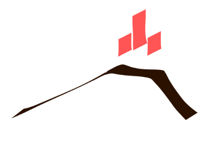
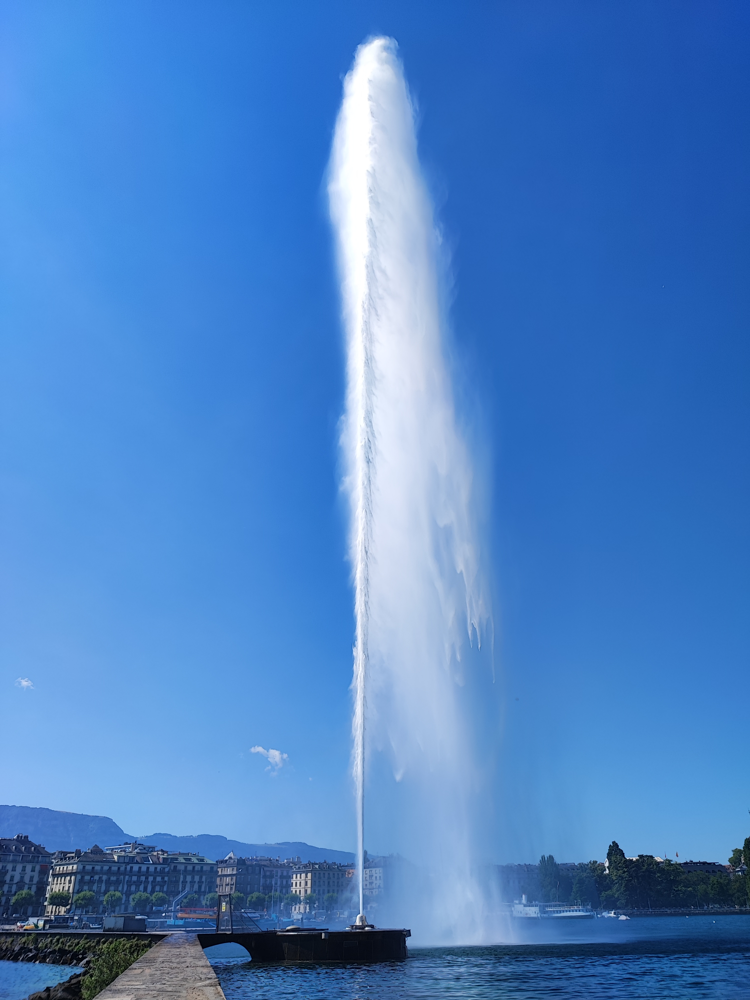

# IAVCEI Commission on Statistics in Volcanology
## Newsletter 1 2025
### Message from outgoing co-leaders and activities
Stuart Mead and Susanna Jenkins were co-leaders from the IAVCEI Scientific Assembly in Rotorua. Leading is rewarding, but challenging, the short time between assemblies and our presence in the antipodes made co-ordination and communication complex. Despite this, we would like to think all members who have supported the commission with ideas, supporting sessions at major conferences, administration of the *Statistics in Volcanology* journal, and laying the groundwork for an exciting workshop.

Thank you for your support. We look forward to the new leadership and contributing as part of the COSIV community.

*Susanna Jenkins and Stuart Mead*

### Business meeting and welcoming our new leaders
Our recent business meeting (at the IAVCEI Scientific Assembly 2025) was organised to summarise recent activities and elect new leadership. The main aims are to invigorate the commission, maintain a strong presence at upcoming conferences and develop a Statistics in Volcanology workshop.

We are pleased to announce results of the election:

**Leader** Andrea Bevilacqua, Istituto Nazionale di Geofisica e Vulcanologia, Sezione di Pisa, Italy.

**Secretary** Stuart Mead, Massey University, School of Agriculture and Environment, New Zealand.

**ECR Representative** Vanesa Burgos, University of Alaska-Fairbanks, Geophyical Institute, USA.

Outgoing co-leader Susanna Jenkins will remain on the board in an ex-officio role to support the transition.

Congratulations to the new leaders!

### Spotlight Statistical Volcanology workshop

We’re excited to announce plans for a dedicated Statistical Volcanology Workshop, inspired by the successful model used in Statistical Seismology and the past experiences of the COSIV workshops at Lassen Volcano, USA (2017) and Kagoshima, Japan (2013).

The current idea is to host single-stream session over 3-4 years, provisionally in 2026-2027, with Europe seeming a central location. The goals will be to build our community, share methods and explore the potential for institutional support from IAVCEI, IUGG and local organizations. If you’re interested in helping shape or support this event, please get in touch!

### Key items for members
Here is how you can contribute to COSIV

**1. Update your membership info**
Our mailing list may be incomplete or outdated. If you're a current or prospective member, please fill out the form to help us stay connected, and share with colleagues the membership from is [here](https://forms.gle/zw3BxyJSuV8w5NPS7)

**2. Get involved in sessions**
If you are planning a session in a volcanology related conference (it can be local or international), COSIV can sponsor session proposals to help with acceptance and find members to support convening. Reach out to the leadership for support.

**3. Other initiatives**
The previous working group on volcanic record completeness has wrapped up, and we welcome new ideas for collaborative projects. Whether you're interested in forming a new working group or contributing to ongoing efforts, COSIV provides a platform to connect and create.

One great way to share your work is through the [Statistics in Volcanology](https://digitalcommons.usf.edu/siv) journal—an open-access, peer-reviewed outlet for innovative statistical approaches in volcanology. Submissions are encouraged, and the editorial team is happy to discuss scope and ideas.

### A note on membership and call for other interested leaders
The IAVCEI [by-laws](https://www.iavceivolcano.org/statutes-and-by-laws/) state that commission activites must support IAVCEI members. As a not-for-profit, this means some technicalities for a commission. Notably leaders, and those who elect leaders, **must** be members. We strongly encourage everyone to be a member of IAVCEI, however you can be a *non-voting* member of the commission if you are not a IAVCEI member. The IAVCEI leadership do not want financial constraints to be an obstacle for membership and active support of a commission. Particularly, people in leadership with the commissions, but lacking the financial ability to become a member of IAVCEI may be eligible for discounted membership.

We are hoping to diversify our leadership board and include more early career researchers. We are also seeking nominations for an equity, diversity and inclusion (EDI) officer. Please contact the leadership if you are interested and we can hold an official online election process for these positions.

### Looking Ahead
COSIV aims to maintain a strong presence in the following **Upcoming conferences**, your ideas and participation is encouraged!

Cities and Volcanoes: Global Volcano Communities (TBC)

IUGG 2027 General Assembly, Seoul

---
Thank you to all who participated in the past commission activities and helped to make a successful conference in Geneva!

*Jet d'Eau at the IAVCEI Scientific Assembly in Geneva, image from Andrea Bevilacqua*

